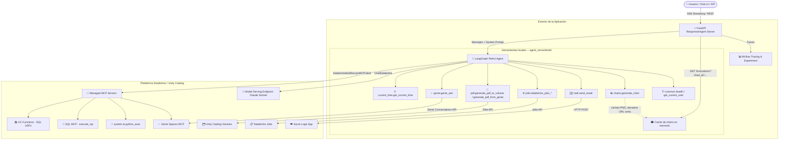

# 🤖 Databricks LangGraph Agent con Soporte MCP y Visualizaciones

Aplicación de agente conversacional inteligente para analítica de datos en **Databricks**, construida con **LangGraph**, **MLflow ResponsesAgent API**, integración con servidores **MCP (Model Context Protocol)** y un motor avanzado de **generación de visualizaciones y gráficas**.

La aplicación incluye un servidor backend en FastAPI compatible con la especificación de OpenAI Responses API, una interfaz de chat web integrada (Next.js) y soporte para despliegue automatizado en **Databricks Apps** mediante **Databricks Asset Bundles (DABs)**.

---

## 📐 Arquitectura del Sistema



---

## ✨ Características Principales

1. **Respuestas Limpias y Estructuradas (Sin JSON Crudo):**
   * El agente procesa internamente todas las salidas de Unity Catalog, SQL MCP, Genie, Jobs, PDF y correo.
   * **Nunca muestra al usuario payloads técnicos** como `{"query": "SHOW CATALOGS"}`, `statement_id`, `manifest`, `data_array`, `run_id` o dicts crudos de `status`/`message`.
   * Formatea los datos en tablas Markdown elegantes, listas con viñetas y resúmenes ejecutivos en español.
   * **El chat solo muestra lenguaje natural, tablas y gráficas** -- el panel crudo de "Parameters"/"Result" por cada llamada a herramienta viene oculto por defecto (ver [Interfaz de Chat](#-interfaz-de-chat-sin-panel-de-tool-calls) más abajo).

2. **Motor de Visualizaciones y Gráficas (`generate_chart`):**
   * Renderiza gráficas con matplotlib y las sirve como imagen PNG real vía HTTP (no como `data:` URI embebido -- el frontend bloquea imágenes `data:` por defecto; ver [detalle técnico](#-herramienta-de-visualización-generate_chart) más abajo).
   * Soporta **8 tipos de gráficos**: `bar`/`column`, `horizontal_bar`, `line`/`trend`, `pie`/`donut`, `area`, `scatter`, `histogram`.
   * Paletas de color modernas: `vibrant`, `modern`, `ocean`, `emerald`, `sunset`, `purple`, `corporate`.

3. **Integración con Servidores MCP de Databricks (gobernados, service principal):**
   * **`system-ai`**: Intérprete de código Python (`system.ai.python_exec`).
   * **`uc-functions`**: Ejecución gobernada de UDFs y funciones SQL en Unity Catalog (`UC_FUNCTIONS_CATALOG.UC_FUNCTIONS_SCHEMA`).
   * **`sql`**: `execute_sql` / `execute_sql_read_only` / `poll_sql_result` contra Unity Catalog (requiere que el service principal tenga `CAN_USE` en al menos un SQL Warehouse -- ver recurso `sql_warehouse` en `databricks.yml`; la URL del MCP no toma un warehouse_id).
   * **`genie`**: Un servidor MCP por cada ID en `GENIE_SPACE_IDS` -- consultas en lenguaje natural contra los espacios Genie configurados.

4. **Herramientas de código locales (`agent_server/tools/`) -- portadas de un servidor MCP propio:**
   * **`genie_ask`**: consumo directo de la API de conversaciones de Genie (alternativa/complemento al MCP de Genie, con control explícito de `conversation_id`/`timeout`).
   * **`generate_pdf_to_volume`** / **`generate_pdf_from_genie`**: genera un reporte PDF (texto + tablas) y lo guarda en un volumen de Unity Catalog; la segunda variante toma el contenido directamente de una respuesta de Genie.
   * **`send_email`**: envía correo vía una Azure Logic App (deshabilitada hasta configurar `LOGIC_APP_MAIL_URL`).
   * **`databricks_jobs_list_jobs` / `run_job` / `get_run_status` / `run_job_and_wait` / `cancel_run`**: ejecución y monitoreo de Jobs de Databricks vía la Jobs API.
   * **`health`** / **`get_current_user`**: utilidades de diagnóstico e identidad.
   * Ver [Herramientas Locales (`agent_server/tools/`)](#-herramientas-locales-agent_servertools) para el detalle módulo por módulo.

5. **Trazabilidad y Observabilidad:**
   * Registro automático de spans, pasos del agente y llamadas a herramientas mediante **MLflow Autologging**.
   * Agrupación por sesión de conversación (`session_id`).

---

## 📁 Estructura del Proyecto

```
agent-databricks-langgraph/
├── agent_server/
│   ├── __init__.py
│   ├── agent.py               # Lógica del agente LangGraph, prompt del sistema y MCPs
│   ├── evaluate_agent.py      # Script de evaluación con scorers de MLflow
│   ├── start_server.py        # Servidor FastAPI ResponsesAgent + proxy de chat + GET /invocations (charts)
│   ├── utils.py                # Helpers de streaming, auth y sesiones
│   └── tools/                  # Herramientas locales (code tools), un módulo por dominio
│       ├── __init__.py         # ALL_LOCAL_TOOLS -- lista agregada que consume agent.py
│       ├── current_time.py      # get_current_time
│       ├── charts.py            # generate_chart + cache de PNGs en memoria (get_cached_chart)
│       ├── genie.py              # ask_genie (helpers puros) + tool genie_ask
│       ├── jobs.py               # Databricks Jobs: helpers puros + tools databricks_jobs_*
│       ├── mail.py               # Envío de correo vía Azure Logic App + tool send_email
│       ├── pdf.py                 # Generación de PDF + tools generate_pdf_to_volume/_from_genie
│       ├── volumes.py             # Helpers genéricos de subida a UC Volumes (usado por pdf.py)
│       └── common.py              # health, get_current_user
├── scripts/
│   ├── discover_tools.py      # Descubridor de recursos disponibles en el workspace
│   ├── preflight.py           # Verificación previa al despliegue
│   ├── quickstart.py          # Asistente interactivo de configuración inicial
│   └── start_app.py           # Lanzador concurrente de backend y frontend; parchea la UI del chat (ver abajo)
├── .claude/skills/            # Habilidades y guías operativas para asistentes de IA
├── databricks.yml             # Definición del Bundle DAB, recursos y permisos
├── app.yaml                   # Configuración para Databricks Apps
├── pyproject.toml             # Dependencias del proyecto (uv / pip)
└── README.md                  # Documentación del proyecto
```

> **Nota sobre el despliegue real:** este repo es la fuente del código del agente (y contiene un `databricks.yml` de referencia con el mismo esquema de recursos). Si tu organización ya usa un bundle DAB separado que orquesta múltiples agentes (ej. `agents-databricks-bundle`, con `git_repository`/`git_source` apuntando a este repo), **ese bundle es el que gobierna el deploy real** -- sus `resources/apps/<agente>.yml` deben mantenerse en sync manualmente con los recursos declarados aquí (mismo `name`, mismos env vars, mismos permisos).

---

## 🚀 Inicio Rápido (Quickstart)

### 1. Requisitos Previos
* **Python >= 3.11** y gestor de paquetes [`uv`](https://docs.astral.sh/uv/getting-started/installation/).
* **Node.js 20 LTS** y `nvm`.
* **Databricks CLI** (versión `0.298.0` o superior).

### 2. Autenticación con Databricks CLI
Inicia sesión en tu workspace de Databricks:
```bash
databricks auth login --host https://<tu-workspace>.databricks.com
```

### 3. Configuración Inicial Automatizada
Ejecuta el asistente interactivo:
```bash
uv run quickstart
```
Este comando verificará tus herramientas, autenticación, creará el experimento en MLflow y configurará tu archivo `.env`.

---

## 💻 Desarrollo Local

### Iniciar Frontend + Backend
Para iniciar tanto el servidor del agente (puerto 8000) como la interfaz de chat web (puerto 3000):
```bash
uv run start-app
```
Abre tu navegador en [http://localhost:8000](http://localhost:8000) para interactuar con el agente.

### Iniciar únicamente el Servidor Backend
```bash
uv run start-server --reload
```

### Probar vía REST API (cURL)
**Petición con Streaming (SSE):**
```bash
curl -X POST http://localhost:8000/invocations \
  -H "Content-Type: application/json" \
  -d '{
    "input": [{"role": "user", "content": "Muestra los catálogos disponibles y genera una gráfica con el número de tablas"}],
    "stream": true
  }'
```

---

## ⚙️ Configuración y Variables de Entorno

Crea o edita tu archivo `.env` en la raíz del proyecto:

| Variable | Descripción | Valor por Defecto |
| :--- | :--- | :--- |
| `DATABRICKS_CONFIG_PROFILE` | Perfil de autenticación de Databricks CLI | `DEFAULT` |
| `MLFLOW_EXPERIMENT_ID` | ID del experimento de MLflow para tracing | *(Requerido)* |
| `UC_FUNCTIONS_CATALOG` | Catálogo de Unity Catalog para funciones SQL | `main` |
| `UC_FUNCTIONS_SCHEMA` | Esquema de Unity Catalog para funciones SQL | `default` |
| `GENIE_SPACE_IDS` | IDs de espacios Genie (separados por coma) expuestos vía MCP | `unset` |
| `PDF_TARGET_VOLUME` | Volumen UC por defecto (`/Volumes/cat/sch/vol`) para `generate_pdf_to_volume`/`generate_pdf_from_genie` | `unset` |
| `LOGIC_APP_MAIL_URL` | URL del trigger HTTP de la Logic App para `send_email` (trátala como secreto) | *(sin configurar)* |
| `LOGIC_APP_MAIL_TIMEOUT_SECONDS` | Timeout de la llamada HTTP a la Logic App | `30` |
| `CHAT_APP_PORT` | Puerto de la interfaz web de chat | `3000` |

> El MCP de SQL (`execute_sql`/`execute_sql_read_only`) no toma un `SQL_WAREHOUSE_ID` por variable de entorno -- su URL (`/api/2.0/mcp/sql`) no incluye un warehouse; Databricks resuelve el warehouse a partir de los permisos del caller. El recurso `sql_warehouse` en `databricks.yml` solo otorga `CAN_USE` al service principal de la app.

---

## 📦 Despliegue en Databricks Apps (DABs)

El despliegue se gestiona de forma declarativa mediante **Databricks Asset Bundles (DABs)** con [databricks.yml](file:///c:/Users/jehider.pinto/Desktop/ARGOS/caso_uso/agent-databricks-langgraph/databricks.yml).

### Flujo de Despliegue Paso a Paso:

```bash
# 1. Ejecutar prueba previa (pre-flight check)
uv run preflight

# 2. Validar la configuración del bundle
databricks bundle validate

# 3. Desplegar los archivos y recursos en Databricks
databricks bundle deploy

# 4. Iniciar o reiniciar la aplicación (¡OBLIGATORIO para aplicar cambios de código!)
databricks bundle run agent_langgraph
```

> ⚠️ **IMPORTANTE:** `databricks bundle deploy` solo sube los archivos y actualiza recursos. Para que la aplicación se reinicie con el nuevo código, es indispensable ejecutar `databricks bundle run agent_langgraph`.

---

## 🔒 Gestión de Permisos y Service Principal

Cuando la aplicación corre en **Databricks Apps**:

1. **Identidad de la Aplicación:** Se ejecuta bajo la identidad de un **Service Principal** propio de la App.
2. **Permisos en Unity Catalog:** El Service Principal debe tener permisos suficientes para ejecutar herramientas MCP y las tools locales que uses:
   * Permiso `CAN_USE` en el SQL Warehouse configurado (para el MCP de SQL).
   * Permisos `USE CATALOG`, `USE SCHEMA` y `EXECUTE` en el catálogo/esquema de funciones (MCP de UC Functions).
   * Permiso `CAN_RUN` en cada Genie Space listado en `GENIE_SPACE_IDS`.
   * Permiso `WRITE_VOLUME` en el volumen configurado en `PDF_TARGET_VOLUME`, si usas las tools de PDF.
   * Permisos sobre el/los Job(s) concretos, si usas las tools `databricks_jobs_*` (esto se otorga directamente en el Job, no vía `databricks.yml`).
3. **Declaración en `databricks.yml`:**
   ```yaml
   resources:
     apps:
       agent_langgraph:
         resources:
           - name: 'experiment'
             experiment:
               experiment_id: "3871103648862313"
               permission: 'CAN_MANAGE'
           - name: 'sql_warehouse'
             sql_warehouse:
               id: '6fadc34945c1c177'
               permission: 'CAN_USE'
           - name: 'genie_space'
             genie_space:
               name: 'genie_space'
               space_id: '01f14fd31b731643881aa99b62170b4a'
               permission: 'CAN_RUN'
           # Descomentar al configurar PDF_TARGET_VOLUME con un volumen real:
           # - name: 'pdf_target_volume'
           #   uc_securable:
           #     securable_full_name: '<catalog>.<schema>.<volume>'
           #     securable_type: 'VOLUME'
           #     permission: 'WRITE_VOLUME'
   ```

### Autenticación en nombre del usuario (On-Behalf-Of)
Si deseas que el agente actúe con los permisos del usuario que realiza la consulta en lugar del Service Principal, activa `get_user_workspace_client()` en [agent.py](file:///c:/Users/jehider.pinto/Desktop/ARGOS/caso_uso/agent-databricks-langgraph/agent_server/agent.py):

```python
# En stream_handler:
agent = await init_agent(workspace_client=get_user_workspace_client())
```

---

## 🛠️ Herramienta de Visualización (`generate_chart`)

La herramienta [agent_server/tools/charts.py](file:///c:/Users/jehider.pinto/Desktop/ARGOS/caso_uso/agent-databricks-langgraph/agent_server/tools/charts.py) permite graficar datos tabulares automáticamente.

### Parámetros:
* `data`: Lista de diccionarios o string JSON con los datos (ej. `[{"categoria": "A", "total": 100}, ...]`).
* `chart_type`: Tipo de gráfico (`bar`, `horizontal_bar`, `line`, `pie`, `donut`, `area`, `scatter`, `histogram`).
* `x_key`: Nombre de la columna para el eje X o categorías.
* `y_keys`: Lista de nombres de columnas numéricas para el eje Y o valores.
* `title`: Título descriptivo de la gráfica.
* `palette`: Paleta de colores (`vibrant`, `modern`, `ocean`, `emerald`, `sunset`, `purple`, `corporate`).
* `show_values`: Booleano para mostrar etiquetas de valor sobre los elementos (por defecto `True`).

### Por qué la imagen se sirve por HTTP y no como `data:` URI embebido

`generate_chart` renderiza el PNG con matplotlib, lo guarda en una caché en memoria (`_CHART_CACHE`, acotada a 50 gráficas) y devuelve un markdown corto: ``.

Esto no es una elección de estilo: la interfaz de chat (`e2e-chatbot-app-next`, ver [Interfaz de Chat](#-interfaz-de-chat-sin-panel-de-tool-calls)) usa el renderer de markdown **Streamdown**, que por defecto **bloquea** imágenes con esquema `data:` (los reemplaza por un placeholder "Image blocked: ..."). Además, el frontend es un template externo clonado en cada arranque -- no podemos simplemente cambiar su configuración de renderer de forma permanente.

La única ruta del backend que el frontend reenvía al navegador es `POST /invocations` (ver `server/src/index.ts` de `e2e-chatbot-app-next`), así que:
1. `generate_chart` cachea el PNG y devuelve `/invocations?chart_id=...` como URL relativa.
2. `agent_server/start_server.py` registra un `GET /invocations` (distinto método, mismo path) que busca el `chart_id` en la caché y devuelve los bytes con `Content-Type: image/png`.
3. Como la URL es corta y estable, el modelo puede copiarla textualmente en su respuesta sin riesgo de truncar un base64 de varios KB -- las instrucciones del agente (`AGENT_INSTRUCTIONS` en `agent_server/agent.py`) le exigen incluir esa línea markdown exactamente como la devolvió la herramienta.

---

## 🙈 Interfaz de Chat sin Panel de Tool Calls

Por defecto, el template de chat (`databricks/app-templates` → `e2e-chatbot-app-next`, clonado en cada arranque por `scripts/start_app.py`) renderiza cada llamada a herramienta como un panel colapsable con secciones "Parameters" (el JSON de entrada) y "Result" (la salida cruda). Este proyecto lo oculta para que el chat muestre **únicamente** lenguaje natural, tablas y gráficas renderizadas.

**Cómo funciona:** `ProcessManager.patch_frontend_tool_call_panel()` en `scripts/start_app.py` se ejecuta justo después de clonar el frontend (y antes de `npm install`/`npm run build`). Parchea el componente `MessageToolGroup` en `client/src/components/message.tsx` para que retorne `null` en vez de renderizar el panel -- una única línea insertada (`return null;`) antes de su JSX original, dejando el resto del archivo intacto.

**Por qué así y no forkeando el template:** el frontend se clona desde `databricks/app-templates` en cada arranque de la app (local o desplegada) -- no vive en este repo y no podemos mantener un fork. El parche es *best-effort*: si Databricks actualiza el layout de esa función en el template, el texto ancla no calzará, `patch_frontend_tool_call_panel()` imprime un warning y continúa sin fallar el build (la app queda funcional, solo con el panel de tool calls visible de nuevo).

**Si quieres revertir este comportamiento** (por ejemplo, para depurar qué está llamando el agente), comenta la línea `self.patch_frontend_tool_call_panel()` en `scripts/start_app.py` y vuelve a desplegar, o borra la carpeta `e2e-chatbot-app-next` local antes de correr `uv run start-app` para forzar un clon limpio sin parchear manualmente.

---

## 🧩 Herramientas Locales (`agent_server/tools/`)

Portadas como *agent code tools* (ver `AGENTS.md` → "Agent Code Tools") desde un servidor MCP propio (`template_databricks_assest_bundle_mcp`, app `mcp_star`) -- en vez de conectarse a ese servidor por MCP, su lógica vive directamente en este repo, un módulo por dominio:

| Módulo | Tools expuestas | Identidad usada | Requiere configurar |
| :--- | :--- | :--- | :--- |
| `current_time.py` | `get_current_time` | — | — |
| `charts.py` | `generate_chart` | — (sin llamadas a Databricks) | — |
| `genie.py` | `genie_ask` | Service principal (`WorkspaceClient()`) | Ninguno (recibe `space_id` por llamada) |
| `pdf.py` | `generate_pdf_to_volume`, `generate_pdf_from_genie` | Service principal | `PDF_TARGET_VOLUME` + permiso `WRITE_VOLUME` |
| `mail.py` | `send_email` | — (HTTP directo a la Logic App) | `LOGIC_APP_MAIL_URL` (secreto) |
| `jobs.py` | `databricks_jobs_list_jobs`, `databricks_jobs_run_job`, `databricks_jobs_get_run_status`, `databricks_jobs_run_job_and_wait`, `databricks_jobs_cancel_run` | Service principal | Permiso sobre el/los job(s) concretos (fuera del bundle, vía permisos de Job en UC/Workspace) |
| `common.py` | `health`, `get_current_user` | `get_current_user` usa el usuario (on-behalf-of, vía `x-forwarded-access-token`) | — |
| `volumes.py` | *(sin tools; helpers usados por `pdf.py`)* | — | — |

Cada módulo expone helpers puros (reciben `WorkspaceClient` explícito, sin globals) además de las funciones `@tool` -- pensado para poder testear la lógica sin pasar por LangChain, y para poder reutilizar un helper desde otro módulo (ej. `pdf.generate_pdf_from_genie` reutiliza `genie.ask_genie`).

`agent_server/tools/__init__.py` agrega todo en `ALL_LOCAL_TOOLS`, que `agent_server/agent.py` añade a la lista de tools del agente junto con las MCP gestionadas por Databricks.

---

## ❓ Solución de Problemas Frecuentes (FAQ)

### 1. ¿Por qué el agente no tiene herramientas tras el despliegue?
* Si alguna herramienta MCP falla por permisos (`403 Forbidden`) o recursos inexistentes, `init_agent()` captura el error para no caer la app, dejando solo las herramientas locales.
* **Solución:** Revisa los logs de la app con `databricks apps logs agent-langgraph --follow` y verifica los permisos del Service Principal en Unity Catalog.

### 2. Error: "An app with the same name already exists"
Si la app ya existía en Databricks, vincúlala al bundle:
```bash
databricks bundle deployment bind agent_langgraph <nombre-app> --auto-approve
databricks bundle deploy
databricks bundle run agent_langgraph
```

### 3. Error 302 al consultar la app desplegada
Las Databricks Apps requieren autenticación **OAuth Bearer Token** (los tokens PAT no son compatibles):
```bash
databricks auth token
```

### 4. `send_email` / `generate_pdf_to_volume` devuelven un error de configuración
Es el comportamiento esperado hasta que configures `LOGIC_APP_MAIL_URL` (correo) o `PDF_TARGET_VOLUME` + permiso `WRITE_VOLUME` (PDF). Ver [Herramientas Locales](#-herramientas-locales-agent_servertools) y el docstring de `agent_server/tools/mail.py` para la guía de configuración de la Logic App.

### 5. Las gráficas se ven como texto crudo `` en el chat
Si ves el markdown de la imagen literal en vez de la imagen renderizada, `generate_chart` está devolviendo una `data:` URI en vez de la URL `/invocations?chart_id=...` esperada -- probablemente estás corriendo una versión anterior del código. Verifica que `agent_server/tools/charts.py` devuelva `f"/invocations?chart_id={chart_id}"` y no un data URI (ver [detalle técnico](#-herramienta-de-visualización-generate_chart)).

---

## 🧪 Evaluación del Agente

Para evaluar la calidad de las respuestas y la precisión de las herramientas con datasets de prueba de MLflow:
```bash
uv run agent-evaluate
```
Los resultados y métricas se registrarán directamente en tu experimento de MLflow en Databricks.
