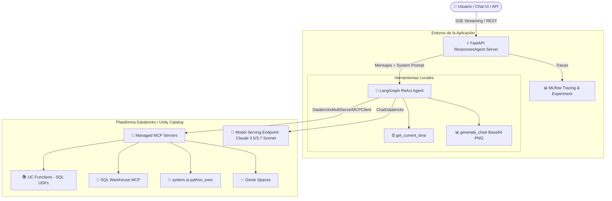

# 🤖 Databricks LangGraph Agent con Soporte MCP y Visualizaciones

Aplicación de agente conversacional inteligente para analítica de datos en **Databricks**, construida con **LangGraph**, **MLflow ResponsesAgent API**, integración con servidores **MCP (Model Context Protocol)** y un motor avanzado de **generación de visualizaciones y gráficas**.

La aplicación incluye un servidor backend en FastAPI compatible con la especificación de OpenAI Responses API, una interfaz de chat web integrada (Next.js) y soporte para despliegue automatizado en **Databricks Apps** mediante **Databricks Asset Bundles (DABs)**.

---

## 📐 Arquitectura del Sistema



---

## ✨ Características Principales

1. **Respuestas Limpias y Estructuradas (Sin JSON Crudo):**
   * El agente procesa internamente todas las salidas de Unity Catalog y SQL MCP.
   * **Nunca muestra al usuario payloads técnicos** como `{"query": "SHOW CATALOGS"}`, `statement_id`, `manifest` o `data_array`.
   * Formatea los datos en tablas Markdown elegantes, listas con viñetas y resúmenes ejecutivos en español.

2. **Motor de Visualizaciones y Gráficas (`generate_chart`):**
   * Permite renderizar gráficas visuales directamente en el chat en formato de imagen **Base64 PNG**.
   * Soporta **8+ tipos de gráficos**:
     * `bar` / `column`: Barras verticales simples o multi-serie.
     * `horizontal_bar`: Barras horizontales (ideal para categorías o tablas con nombres largos).
     * `line` / `trend`: Gráficas de líneas y series de tiempo.
     * `pie` / `donut`: Gráficas de pastel y dona con cálculo automático de porcentajes.
     * `area`: Gráficas de área sombreada.
     * `scatter`: Gráficos de dispersión y correlación.
     * `histogram`: Distribuciones de frecuencia.
   * Paletas de color modernas: `vibrant`, `modern`, `ocean`, `emerald`, `sunset`, `purple`, `corporate`.

3. **Integración con Servidores MCP de Databricks:**
   * **`system-ai`**: Intérprete de código Python (`system.ai.python_exec`).
   * **`uc-functions`**: Ejecución gobernada de UDFs y funciones SQL en Unity Catalog (`UC_FUNCTIONS_CATALOG.UC_FUNCTIONS_SCHEMA`).
   * **`sql`**: Ejecución gobernada de consultas SQL contra un SQL Warehouse (`SQL_WAREHOUSE_ID`).
   * **`genie`**: Consultas en lenguaje natural contra espacios Genie configurados (`GENIE_SPACE_IDS`).

4. **Trazabilidad y Observabilidad:**
   * Registro automático de spans, pasos del agente y llamadas a herramientas mediante **MLflow Autologging**.
   * Agrupación por sesión de conversación (`session_id`).

---

## 📁 Estructura del Proyecto

```
agent-databricks-langgraph/
├── agent_server/
│   ├── __init__.py
│   ├── agent.py               # Lógica del agente LangGraph, prompt del sistema y MCPs
│   ├── evaluate_agent.py      # Script de evaluación con scorers de MLflow
│   ├── start_server.py        # Servidor FastAPI ResponsesAgent con proxy de chat
│   ├── utils.py               # Helpers de streaming, auth y sesiones
│   └── visualization.py       # Motor de visualizaciones matplotlib -> base64
├── scripts/
│   ├── discover_tools.py      # Descubridor de recursos disponibles en el workspace
│   ├── preflight.py           # Verificación previa al despliegue
│   ├── quickstart.py          # Asistente interactivo de configuración inicial
│   └── start_app.py           # Lanzador concurrente de backend y frontend
├── .claude/skills/            # Habilidades y guías operativas para asistentes de IA
├── databricks.yml             # Definición del Bundle DAB, recursos y permisos
├── app.yaml                   # Configuración para Databricks Apps
├── pyproject.toml             # Dependencias del proyecto (uv / pip)
└── README.md                  # Documentación del proyecto
```

---

## 🚀 Inicio Rápido (Quickstart)

### 1. Requisitos Previos
* **Python >= 3.11** y gestor de paquetes [`uv`](https://docs.astral.sh/uv/getting-started/installation/).
* **Node.js 20 LTS** y `nvm`.
* **Databricks CLI** (versión `0.298.0` o superior).

### 2. Autenticación con Databricks CLI
Inicia sesión en tu workspace de Databricks:
```bash
databricks auth login --host https://<tu-workspace>.databricks.com
```

### 3. Configuración Inicial Automatizada
Ejecuta el asistente interactivo:
```bash
uv run quickstart
```
Este comando verificará tus herramientas, autenticación, creará el experimento en MLflow y configurará tu archivo `.env`.

---

## 💻 Desarrollo Local

### Iniciar Frontend + Backend
Para iniciar tanto el servidor del agente (puerto 8000) como la interfaz de chat web (puerto 3000):
```bash
uv run start-app
```
Abre tu navegador en [http://localhost:8000](http://localhost:8000) para interactuar con el agente.

### Iniciar únicamente el Servidor Backend
```bash
uv run start-server --reload
```

### Probar vía REST API (cURL)
**Petición con Streaming (SSE):**
```bash
curl -X POST http://localhost:8000/invocations \
  -H "Content-Type: application/json" \
  -d '{
    "input": [{"role": "user", "content": "Muestra los catálogos disponibles y genera una gráfica con el número de tablas"}],
    "stream": true
  }'
```

---

## ⚙️ Configuración y Variables de Entorno

Crea o edita tu archivo `.env` en la raíz del proyecto:

| Variable | Descripción | Valor por Defecto |
| :--- | :--- | :--- |
| `DATABRICKS_CONFIG_PROFILE` | Perfil de autenticación de Databricks CLI | `DEFAULT` |
| `MLFLOW_EXPERIMENT_ID` | ID del experimento de MLflow para tracing | *(Requerido)* |
| `UC_FUNCTIONS_CATALOG` | Catálogo de Unity Catalog para funciones SQL | `main` |
| `UC_FUNCTIONS_SCHEMA` | Esquema de Unity Catalog para funciones SQL | `default` |
| `SQL_WAREHOUSE_ID` | ID del SQL Warehouse para el MCP de SQL | `unset` |
| `GENIE_SPACE_IDS` | IDs de espacios Genie separados por coma | `unset` |
| `CHAT_APP_PORT` | Puerto de la interfaz web de chat | `3000` |

---

## 📦 Despliegue en Databricks Apps (DABs)

El despliegue se gestiona de forma declarativa mediante **Databricks Asset Bundles (DABs)** con [databricks.yml](file:///c:/Users/jehider.pinto/Desktop/ARGOS/caso_uso/agent-databricks-langgraph/databricks.yml).

### Flujo de Despliegue Paso a Paso:

```bash
# 1. Ejecutar prueba previa (pre-flight check)
uv run preflight

# 2. Validar la configuración del bundle
databricks bundle validate

# 3. Desplegar los archivos y recursos en Databricks
databricks bundle deploy

# 4. Iniciar o reiniciar la aplicación (¡OBLIGATORIO para aplicar cambios de código!)
databricks bundle run agent_langgraph
```

> ⚠️ **IMPORTANTE:** `databricks bundle deploy` solo sube los archivos y actualiza recursos. Para que la aplicación se reinicie con el nuevo código, es indispensable ejecutar `databricks bundle run agent_langgraph`.

---

## 🔒 Gestión de Permisos y Service Principal

Cuando la aplicación corre en **Databricks Apps**:

1. **Identidad de la Aplicación:** Se ejecuta bajo la identidad de un **Service Principal** propio de la App.
2. **Permisos en Unity Catalog:** El Service Principal debe tener permisos suficientes para ejecutar herramientas MCP:
   * Permiso `CAN_USE` en el SQL Warehouse configurado.
   * Permisos `USE CATALOG`, `USE SCHEMA` y `EXECUTE` en el catálogo/esquema de funciones.
3. **Declaración en `databricks.yml`:**
   ```yaml
   resources:
     apps:
       agent_langgraph:
         resources:
           - name: 'experiment'
             experiment:
               experiment_id: "3871103648862313"
               permission: 'CAN_MANAGE'
           - name: 'sql_warehouse'
             sql_warehouse:
               id: '6fadc34945c1c177'
               permission: 'CAN_USE'
   ```

### Autenticación en nombre del usuario (On-Behalf-Of)
Si deseas que el agente actúe con los permisos del usuario que realiza la consulta en lugar del Service Principal, activa `get_user_workspace_client()` en [agent.py](file:///c:/Users/jehider.pinto/Desktop/ARGOS/caso_uso/agent-databricks-langgraph/agent_server/agent.py):

```python
# En stream_handler:
agent = await init_agent(workspace_client=get_user_workspace_client())
```

---

## 🛠️ Herramienta de Visualización (`generate_chart`)

La herramienta [agent_server/visualization.py](file:///c:/Users/jehider.pinto/Desktop/ARGOS/caso_uso/agent-databricks-langgraph/agent_server/visualization.py) permite graficar datos tabulares automáticamente:

### Parámetros:
* `data`: Lista de diccionarios o string JSON con los datos (ej. `[{"categoria": "A", "total": 100}, ...]`).
* `chart_type`: Tipo de gráfico (`bar`, `horizontal_bar`, `line`, `pie`, `donut`, `area`, `scatter`, `histogram`).
* `x_key`: Nombre de la columna para el eje X o categorías.
* `y_keys`: Lista de nombres de columnas numéricas para el eje Y o valores.
* `title`: Título descriptivo de la gráfica.
* `palette`: Paleta de colores (`vibrant`, `modern`, `ocean`, `emerald`, `sunset`, `purple`, `corporate`).
* `show_values`: Booleano para mostrar etiquetas de valor sobre los elementos (por defecto `True`).

---

## ❓ Solución de Problemas Frecuentes (FAQ)

### 1. ¿Por qué el agente no tiene herramientas tras el despliegue?
* Si alguna herramienta MCP falla por permisos (`403 Forbidden`) o recursos inexistentes, `init_agent()` captura el error para no caer la app, dejando solo las herramientas locales.
* **Solución:** Revisa los logs de la app con `databricks apps logs agent-langgraph --follow` y verifica los permisos del Service Principal en Unity Catalog.

### 2. Error: "An app with the same name already exists"
Si la app ya existía en Databricks, vincúlala al bundle:
```bash
databricks bundle deployment bind agent_langgraph <nombre-app> --auto-approve
databricks bundle deploy
databricks bundle run agent_langgraph
```

### 3. Error 302 al consultar la app desplegada
Las Databricks Apps requieren autenticación **OAuth Bearer Token** (los tokens PAT no son compatibles):
```bash
databricks auth token
```

---

## 🧪 Evaluación del Agente

Para evaluar la calidad de las respuestas y la precisión de las herramientas con datasets de prueba de MLflow:
```bash
uv run agent-evaluate
```
Los resultados y métricas se registrarán directamente en tu experimento de MLflow en Databricks.
